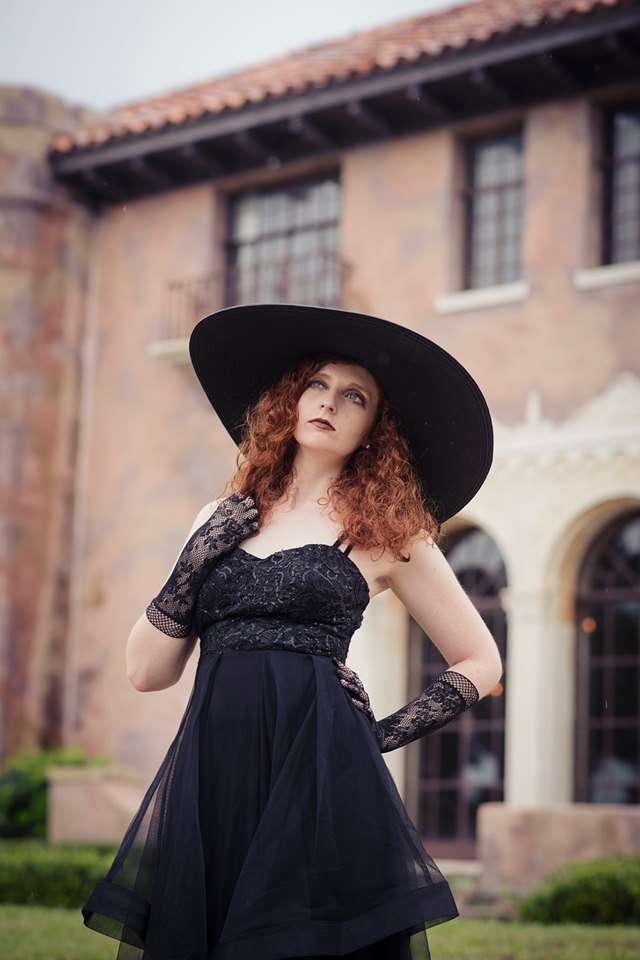
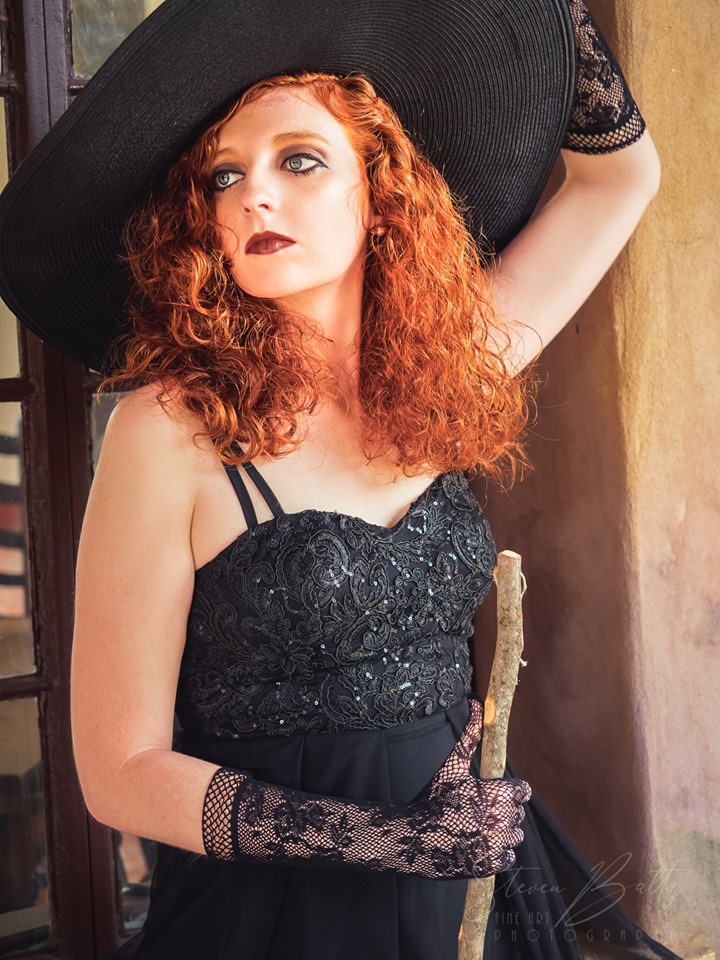
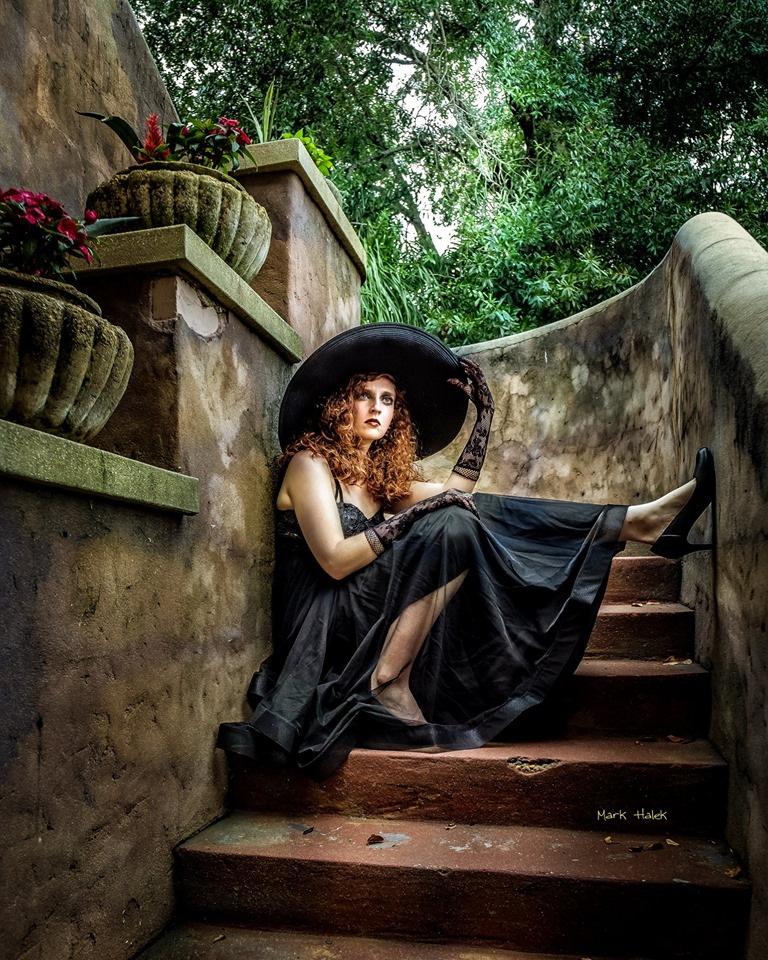
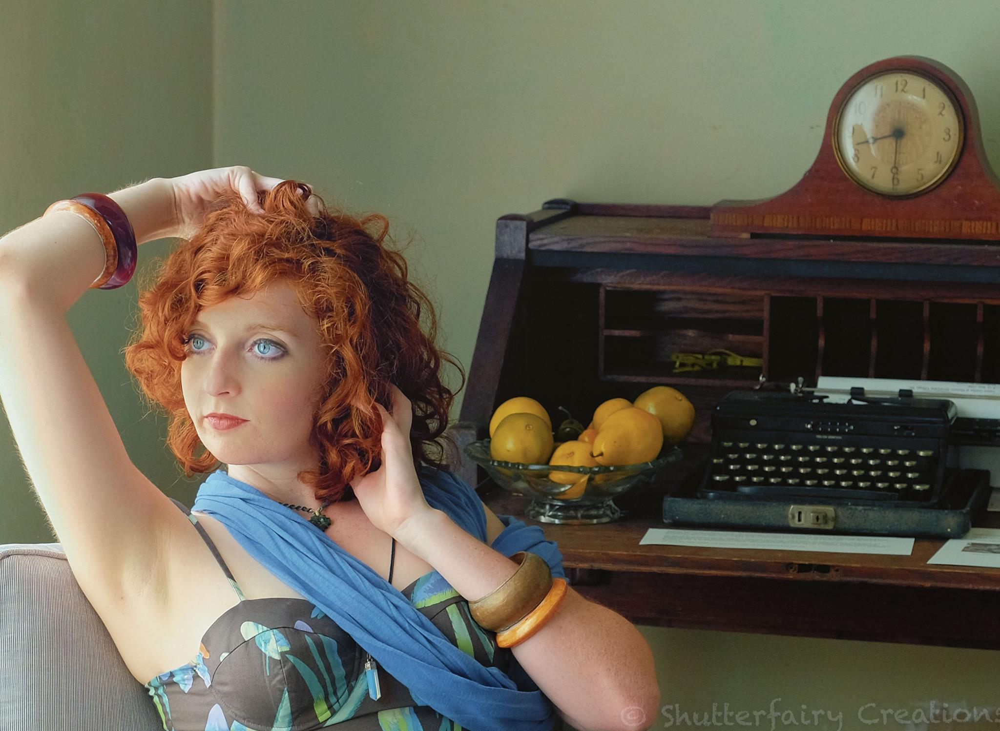

I am an graduate student majoring in physics, living in Rochester, NY. I got my undergrate Physics degree at Florida Tech in 2019. My curiosity for the world propels me to spend many hours researching, experimenting, and writing. Some of what I write ends up being shared here.

Post topics include emotional health, skill development, technical projects, creativity, the environment and sustainability—any insights I feel others may benefit from.

Since my traumatic experiences of 2016, I've committed to living according to the question, "*What would somebody who loved themselves do?*" See the results of that in [365 Days of Self Love]({{ site.url }}/blog/2017/04/365-days-of-self-love/).

For more on those life-altering experiences, read [Mental Illness]({{ site.url }}/blog/2018/02/mental-illness/) and [Manipulation]({{ site.url }}/blog/2018/04/manipulation/).

I study, experiment, and explore the questions that stem from this question: <em>How we can live better, both as individuals and as a society?</em>

My creative outlets include hula hooping (flow arts), programming, modeling, and drawing. I used to stubbornly pursue a visual arts career until an unexpected encounter with a palm reader: [Finding Purpose & Rhythm]({{ site.url }}/blog/2019/07/finding-purpose/).

This blog is my outlet for sharing what I discover along this journey.

I make the work I want to see exist in the world.
It makes me happy to create this work, and so, I share it with you.

<!--  -->
<!--  -->

<!--  -->

<figcaption>Photographers credited: <a href="https://www.facebook.com/ericswallick">Eric Swallick</a>, <a href="https://www.facebook.com/marty.roland">Martin Roland</a>, <a href="https://www.facebook.com/stephen.little.3304">Stephen Little</a>, <a href="https://www.facebook.com/mark.halek.1">Mark Halek</a>, <a href="https://www.facebook.com/profile.php?id=100010341669531">Tom Matthews</a>, <a href="https://www.facebook.com/carrie.mclellan.77">Carrie McLellan</a>, <a href="https://www.facebook.com/jennifer.slak">Jennifer Slak</a>, <a href="https://www.facebook.com/steven.baltz">Steven Baltz</a>, <a href="https://www.facebook.com/ty.lucas.90834">Ty Lucas</a></figcaption>
<!-- <a href="https://www.facebook.com/mille.sorger">Millie Sorger</a>-->

