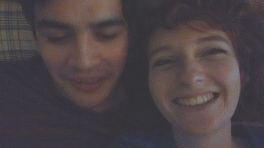

I am a writer and illustrator living in Brevard County, Florida.
I read a lot, do a lot, think a lot, and get a lot of ideas. Some of these ideas get polished enough to become the gems I put on display in this blog.

My work is motivated by this question: <em>How can I communicate the most amount of content in the most potent way possible? The quickest, simplest,  most impactful way?</em>

The journey has led to me to leverage my drawing passion that I've exercised since childhood, along with developing a writing skill that I improved through my <em>Cheating College</em> blog I ran in 2014-5. I also practice public speaking and explore visual thinking techniques from the obscure field of graphic facilitation.

I'm currently focused on teaching myself animation of the two kinds of flavors: Handdrawn Disney style frame-by-frame animation, and web animation made with CSS and JavaScript.

To test these different methods of content-delivery, I tackle the most abstract and complex problems that excite me. I research and study the selected problem until I get hit with an insight, usually in the form of a clear and simple solution. Then I communicate this solution the best way I can. <em>ie: <a href="../assets/img/CC/college-flowchart.png">College Gamble Flowchart</a>.</em>

To find problems to dissect for these high-level projects, I study, experiment, and explore the questions that stem from this question: <em>How we can live better, both as individuals and as a society?</em>

This blog is my outlet for sharing what I discover along this journey.

Post topics range from skill development, creativity, philosophy, life lessons, how society and institutions can be improved, and project implementation... I have many interests, so essentially anything I feel others may benefit from.

I make the work I want to see exist in the world.
It makes me happy to create this work, and so, I share it with you. 

*Flowers and hat photo credits: <a href="https://www.facebook.com/ericswallick?fref=ts">Eric Swallick photography</a>*

